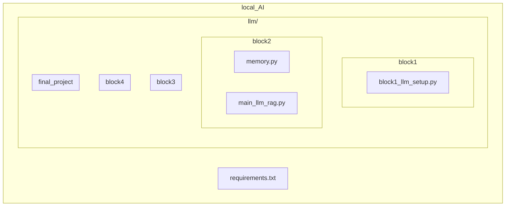

# Локальный ИИ-ассистент для аналитики документов и построения сводок
## Проект направлен на реализацию и построение локальной llm-модели, не требующей больших вычислительных ресурсов и сложных установочных процессов. Модель способна сохранять историю диалога, хранить в векторном виде необходимые тексты и docx-, pdf-документы для последующего анализа информации в них и вывода необходимых данных на основе запроса пользователя. Есть возможность вставять и тестировать несколько вариантов llm-, emdedding-моделей для возможного улучшения работы программы, в экспериментальных целях или в целях оптимизации процесса.  
## Setup:
- git clone https://github.com/d1seternal/local_AI.git cd local_AI
- conda activate your-env
- pip install llama-cpp-python Пример загрузки llm-модели через HuggingFace:  pip install huggingface-hub hf download TheBloke/Mistral-7B-Instruct-v0.2-GGUF/mistral-7b-instruct-v0.2.Q6_K.gguf --local-dir
- pip install -r requirements.txt
## Requirements.txt (текущие в проекте):
conda==26.1.1 cmake==3.29.5-msvc4 llama-cpp-python==0.3.16 torch==2.10.0 chromadb==1.5.2 sentence-transformers==5.2.3 PyPDF2==3.0.1 python-docx==1.2.0 python==3.11.4
## Структура проекта:

*  block1_setup - первый блок для настройки и бенчмаркинга llm-моделей. Блок содержит один файл block1_llm_setup.py для тестирования определенной языковой модели. С помощью данного python-модуля были протестированы различные модели, например: mistral-7b-instruct-v0.2.Q4_K_M, mistral-7b-instruct-v0.2.Q6_K, Phi-3-mini-4k-instruct-q4 (все модели квантизованы (q4- и q6-квантизации, поскольку в проекте исследуются возможности именно квантизованных GGUF-моделей). Для смены тестируемой модели достаточно указать путь к загруженной модели и в функции загрузки модели load_model для параметра chat_format указать необходимый формат чата с конкретными для модели разметочными словами (необходимые шаблоны можно найти при загрузке модели на HuggingFace). Результат работы первого блока - локально запущенная llm-модель, принимающая текстовые запросы и возвращающая ответ. 
*  block2_memory - второй блок для подключения памяти и контекста агента. Память была реализовна через векторную базу данных ChromaDb - она хорошо сочетается с python-проектом и достаточно проста для установки. ChromaDB подходит для небольших локальных проектов, проста в освоени, имеет неплохую скорость обработки данных (векторный семантический поиск через косинусную близость (HNSW), что подходит для текстовой обработки + неплохие показатели на QPS и Recall). В дальнейшем по мере увеличения масштабов обработки информации можно будет сменить векторную БД (например, на Qdrant, которая имеет смешанный механизм обработки и нахождения информации из векторного поиска + фильтрации по метаданным и повышенную производительность по причине поддержки масштабируемости данных. Результат работы второго блока - предварительно созданная RAG-система, которая принимает текстовые документы, индексирует их, а при вопросе клиента выдает наиболее релевантный ответ (список релевантных ответов). Подключены память и контекст, благодаря чему система сохраняет добавленные документы, хранит обработанные данные и выдает результаты поиска клиенту после нового запуска диалога (при условии, что документы не были удалены по инициативе пользователя). 
