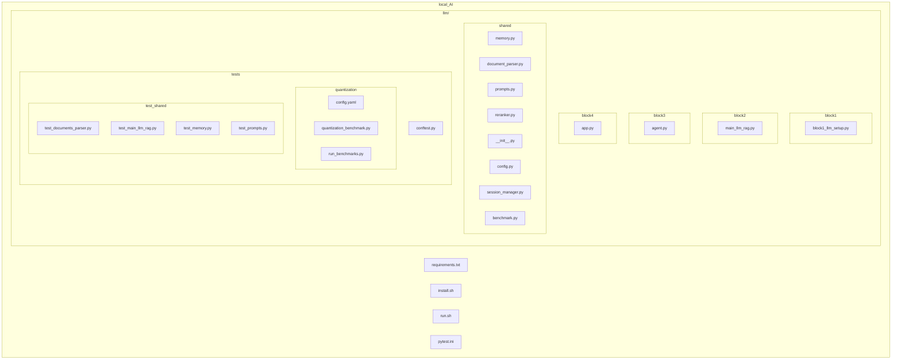
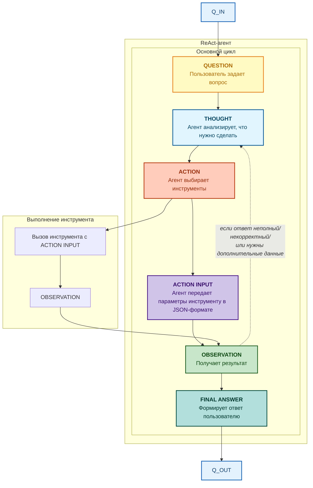

# Локальный ИИ-ассистент для аналитики документов и построения сводок
## Проект направлен на реализацию и построение локальной llm-модели, не требующей больших вычислительных ресурсов и сложных установочных процессов. Модель способна сохранять историю диалога, хранить в векторном виде необходимые тексты и docx-, pdf-документы для последующего анализа информации в них и вывода необходимых данных на основе запроса пользователя. Есть возможность интегрировать и тестировать желаемые варианты llm-, emdedding-моделей для возможного улучшения работы программы, в экспериментальных целях или в целях оптимизации процесса.  
## Setup:
**Kлонирование репозитория:**<br>
git clone https://github.com/d1seternal/local_AI.git<br>
cd local_AI<br>

**install.sh:**
```bash
#!/bin/bash
set -e
# System packages
sudo apt install -y \
    git git-lfs \
    python3 python3-pip python3-venv \
    build-essential gcc g++ make \
    cmake pkg-config \
    libopenblas-dev \
    curl wget unzip \
    htop tmux \
    sqlite3

git lfs install

if [ ! -f /swapfile ]; then
    sudo fallocate -l 8G /swapfile
    sudo chmod 600 /swapfile
    sudo mkswap /swapfile
    sudo swapon /swapfile
    echo '/swapfile none swap sw 0 0' | sudo tee -a /etc/fstab
fi

# Python venv
python3 -m venv venv
source venv/bin/activate

pip install --upgrade pip setuptools wheel

# Requirements
pip install -r requirements.txt

# llama-cpp-python
CMAKE_ARGS="-DLLAMA_BLAS=ON -DLLAMA_BLAS_VENDOR=OpenBLAS" \
pip install llama-cpp-python --force-reinstall --no-cache-dir
```

**run.sh:**
```bash
#!/bin/bash
set -e

source venv/bin/activate
# Скачать модель, если нет
MODEL_DIR="models"
MODEL_FILE="deepseek-r1-qwen3-8b-q4_k_m.gguf"
if [ ! -f "$MODEL_DIR/$MODEL_FILE" ]; then
    echo "Скачиваю модель..."
    mkdir -p $MODEL_DIR
    hf download muranAI/DeepSeek-R1-0528-Qwen3-8B-GGUF $MODEL_FILE --local-dir $MODEL_DIR
fi

EMBEDDING_DIR="models"
EMBEDDING_FILE="multilingual-e5-base"
if [ ! -d "$EMBEDDING_DIR/$EMBEDDING_FILE" ]; then
    echo "Скачиваю модель эмбеддингов..."
    python -c "
from sentence_transformers import SentenceTransformer
model = SentenceTransformer('intfloat/multilingual-e5-base')
model.save('$EMBEDDING_DIR')
print('Модель эмбеддингов сохранена локально')
"
else
    echo "Модель эмбеддингов уже есть"
fi


python3 llm/block4_web/app.py
```
- Также используются механизмы для ускорения выичислительных процессов и генерации ответов. Ускорять процесс можно либо через GPU, либо через CPU (если нет возможности ускориться через GPU). Самой распространенной технологией для видеокарт NVIDIA является CUDA (Compute Unified Device Architecture) - технология компании NVIDIA, которая позволяет использовать графический процессор (GPU) вместо центрального процессора (CPU) для выполнения сложных вычислений. Команда для подключения ускорения при установке фреймворка llama-cpp-python:<br>
```python
CMAKE_ARGS="-DLLAMA_CUBLAS=on" pip install llama-cpp-python #CUDA
CMAKE_ARGS="-DLLAMA_VULKAN=on" pip install llama-cpp-python #аналог для AMD-видеокарт; необходимо проверить, что установлены актуальные драйверы для видеокарты и Vulkan SDK
```
Для пользователей без возможности ускорить программу посредством переноса нагрузки на GPU можно использовать технологии OpenBLAS или IntelMKL, которые ускоряют CPU, распараллеливая процессы вычисления. Однако данные методы ощутимого эффекта все же не принесут. Инструкции для подключения ускорения CPU:<br>
```python
CMAKE_ARGS="-DLLAMA_BLAS=ON -DLLAMA_BLAS_VENDOR=OpenBLAS" pip install llama-cpp-python #OpenBLAS

conda clean --all
conda install mkl mkl-include cmake -c conda-forge -y
set CMAKE_ARGS=-DGGML_BLAS=ON -DGGML_BLAS_VENDOR=Intel10_64lp -DBLAS_LIBRARIES=".\envs\your-environment\Library\lib\mkl_rt.lib" -DGGML_BLAS_INCLUDE_DIRS=".\envs\your-environment\Library\include"
set FORCE_CMAKE=1
pip install llama-cpp-python --force-reinstall --no-cache-dir #Intel MKL;подключаемые библиотеки располагаются в соответствующих папках директории установленной anaconda
```
## Requirements.txt (текущие в проекте):
*llama-cpp-python устанавливается отдельно в модуле install.sh<br>
torch==2.10.0<br>
chromadb==1.5.2<br>
sentence-transformers==5.2.3<br>
PyPDF2==3.0.1<br>
python-docx==1.2.0<br>
huggingface-hub==0.36.2<br>
docling[complete]==2.77.0<br>
pandas==2.3.3<br>
tabulate==0.9.0<br>
langchain==1.2.11<br>
langchain-core==1.2.19<br>
langchain-classic==1.0.3<br>
langchain-community==0.4.1<br>
langchain-text-splitters==1.1.1<br>
gradio==6.11.0<br>
gradio-client==2.4.0<br>
pydantic==2.12.5<br>
numpy==1.26.4<br>
pytest==9.0.3<br>
pytest-cov==7.1.0<br>
pytest-mock==3.15.1
## Структура проекта:


*  **block1_setup** - первый блок для настройки и бенчмаркинга llm-моделей. Блок содержит один файл block1_llm_setup.py для тестирования определенной языковой модели. С помощью данного python-модуля были протестированы различные модели, например: mistral-7b-instruct-v0.2.Q4_K_M, mistral-7b-instruct-v0.2.Q6_K, Phi-3-mini-4k-instruct-q4, yarn-mistral-7b-64k.Q4_K_M (для увеличения контекстного окна) - все модели квантизованы (q4- и q6-квантизации, поскольку в проекте исследуются возможности именно квантизованных GGUF-моделей). Для смены тестируемой модели достаточно указать путь к загруженной модели и в функции загрузки модели load_model для параметра chat_format указать необходимый формат чата с конкретными для модели разметочными словами (необходимые шаблоны можно найти при загрузке модели на HuggingFace). Необходимо отметить важный параметр при загрузке llm-модели n_gpu_layers, который определяет, какое количество слоев нейросети будет перенесено из оперативной памяти (RAM) в видеопамять (VRAM) вашей видеокарты для ускорения. Например, если стоит n_gpu_layers=0 — это значит, что видеокарта вообще не используется, и вся работа ложится на процессор (CPU); n_gpu_layers = -1 - максимальная нагрузка на GPU, ускоряющая генерации ответа:<br>
```python
llm = Llama(
        model_path=MODEL_PATH,
        n_ctx=<number of context tokens for your model>,                  
        n_threads=<for example, number of CPU physcial cores>,                   
        n_gpu_layers=0,  #нужный параметр                
        verbose=False,                    
        seed=42,                          
        temperature=0.5,                   
        top_p=0.9,
        chat_format="mistral-instruct"    # можно использовать необходимый формат для конкретной модели                
    ) #параметры устанавливаются на усмотрения разработчика
```

*  Результат работы первого блока - локально запущенная llm-модель, принимающая текстовые запросы и возвращающая ответ.
  
*  **block2_memory** - второй блок для подключения памяти и контекста агента. Память была реализовна через векторную базу данных ChromaDb - она хорошо сочетается с python-проектом и достаточно проста для установки. ChromaDB подходит для небольших локальных проектов, проста в освоении, имеет неплохую скорость обработки данных (векторный семантический поиск через косинусную близость (HNSW), что подходит для текстовой обработки + неплохие показатели на QPS и Recall). В дальнейшем по мере увеличения масштабов обработки информации можно будет сменить векторную БД (например, на Qdrant, которая имеет смешанный механизм обработки и нахождения информации из векторного поиска + фильтрации по метаданным и повышенную производительность по причине поддержки масштабируемости данных). На данном этапе были протестированы следующие эмбеддинговые модели: sentence-transformers/paraphrase-multilingual-MiniLM-L12-v2, DeepPavlov/rubert-base-cased-sentence, intfloat/multilingual-e5-base. Для подключения первых двух моделей в коде достаточно изменить название самой модели, а необходимые корректировки прописаны в функции _get_embedding (поскольку для работы e5-base нужны определенные префиксы):<br>Функция в коде:<br>
```python
def _get_embedding(self, text: str, is_query: bool = False) -> List[float]:
        if "e5" in self.embedding_model_name:
            prefix = "query: " if is_query else "passage: "
            text = prefix + text
        
        embedding = self.embedding_model.encode(text, normalize_embeddings=True)
        return embedding.tolist()
```
<br>Вместо:<br>
```python
def _get_embedding(self, text: str) -> List[float]:
        
    embedding = self.embedding_model.encode(text, normalize_embeddings=True)
    return embedding.tolist()
```
<br>Далее в функциях поиска и индексации заменены query_embedding или embedding на соответствующие им переменные с флагом is_query, например:<br>
```python
query_embedding = self._get_embedding(query) -> query_embedding = self._get_embedding(query, is_query=True)
```
<br>Структура файлов во втором блоке:<br>
- main_llm_rag.py: Основной модуль блока, куда импортируются остальные модули блока, поэтому запустить программу можно, выполнив команду для запуска данного модуля: python main_llm_rag.py
*  Результат работы второго блока - предварительно созданная RAG-система, которая принимает текстовые документы, индексирует их, а при вопросе клиента выдает наиболее релевантный ответ (список релевантных ответов). Подключены память и контекст, благодаря чему система сохраняет добавленные документы, хранит обработанные данные и выдает результаты поиска клиенту после нового запуска диалога (при условии, что документы не были удалены по инициативе пользователя).

* **shared** - пакет с общими модулями для подключения агента или самого RAG-ассиситента.
  
<br>Структура файлов в папке shared:<br>
- prompts.py: Содержит описание системного и пользовательского промпта с инструкциями для модели в целях повышения корректности выводимых ответов. Также для дальнейшей перспективы описаны инструкции для различных типов вопроса (поиск имен/поиск дат/поиск чисел) - программа будет обрабатывать вопрос пользователя и определять для себя шаблон ответа.
- reranker.py: LLM-reranker, который, используя нашу LLM-модель, проходит заново по выбранным документам, определяя их релевантность (для этого пишем промпт, содержащий инструкции для определения степени релевантности фрагмента). Итоговая релевантность выбранного фрагмента складывается из изначальной оценки через векторный поиск + оценки после реранкинга при небольшом приоритете реранкинга (корректировка итоговой оценки с коэффициентами 0.3 и 0.7, либо 0.4 и 0.6: doc_with_score['combined_score'] = round(0.6 * score + 0.4 * original_score, 4)
- document-parser.py: Модуль для парсинга PDF-файлов с помощью библиотеки Docling, либо docx-документов через docx-python. Парсинг можно осуществлять многими способами, игнорируя некоторыми функциями для упрощения процесса или добавляя методы для исключительных ситуаций (сериализация таблиц; обработка сканов и считывание информации из изображений), но 100% результата никто не гарантирует.
- memory.py: Файл с инициализацией векторной памяти и загрузкой эмбеддинговой-модели. Здесь создается векторная БД, коллекции для документов и диалогов, инициализируется выбранная модель для векторизации текста, который затем в виде закодированных чанков будет храниться в коллекции векторной БД. В модуле содержатся функции для индексирования выбранного файла, набранного тескта; функции для векторного поиска необходимых документов; функции для добавления векторизованных документов и диалогов в БД; функции для удаления документов и историй чатов; функции для вывода информации о памяти приложения.
- session_manager.py: Созданный в ходе разработки веб-интерфейса модуль, который отвечает за хранение и обновление сессий клиента при работе с ассистентом. В файле осуществляется загрузка в память сохраненных сессиий, сохранение новых сессий, добавление сообщений в историю сессии, получение истории конкретной сессии или списка всех имеющихся сессиий, удаление выбранной сессии. Каждая сессия сохраняется на диске в формате .json для наглядности и понимания механизма создания и обработки диалогов. Аналогом сохранения json-формата может быть создание новой отдельной коллекции в векторной БД MEMORY_COLLECTION, которая будет сохранять историю диалога параллельно с сохраняющей документы коллекцией DOCS_COLLECTION.
- init.py: Модуль для упрощения импортов в других блоках и контроля экспортируемых данных.
- config.py: Модуль для централизованного хранения настроек проект (для предотвращения хард-кодирования).

*  **block3_agent** - инструменты и автономность. На данном этапе осуществляется превращение нашей LLM в автономную систему с инструментами. Цель: создать локального ReAct-агента, который может полноценно рассуждать, выбирать определенное и доступное ему действие для получения результата на запрос пользователя, ожидать последующего запроса. Здесь была развернута более крупная llm-модель deepseek-r1-qwen3-8b-q4_k_m.gguf, которая относительно неплохо показывает себя на tool calling среди локальных моделей и превосходит, например, yarn-mistral-7b-64k.Q4_K_M. <br>
## Архитектура локального агента выглядит следующим образом:<br>

## Инструменты ReAct-агента: <br>
- vector_list - список файлов
- vector_add - добавление файла в память
- search_documents - искать информацию через RAG
- write_file - записать данные в файл
- execute_python - выполнить Python-код
<br>В программе оставлен инструмент vector_search - если агент не сможет подключиться к RAG-ассистенту, то сможет найти необходимую информацию в базе данных самостоятельно.

<br>Структура файлов в третьем блоке:<br>
- agent.py: Основной модуль с проектированием и запуском агента, куда импортируются все необходимые конфиги и функции из других блоков. Например, агент напрямую связан с RAG-ассистентом при выполнении инструмента search_documents или с session_manager, поскольку непосредственно в агенте используется механизм обработки сессий, включая новую возможность - переключение сессий switch_session для работы с ассистентом в другом контексте. Для запуска ReAct-агента используется именно этот файл.

* **block4_web** - интерфейс и оформление. Целью данного блока было создание продукта, которым можно пользоваться. Веб-интерфейс строился через библиотеку Gradio с окном диалога пользователся и ассистента справа и панелью инструментов слева. Была реализована история диалога посредством добавления нового модуля поддержания сессий session_manager и некоторых функций в agent.py из третьего блока. Теперь присутствует четкое разграничение: memory.py отвечает за инициализацию и поддержание векторной памяти, за добавление и хранение в ней проиндексированных файлов, а session_manager отвечает за создание и хранение сессий отдельно на диске в папке sessions для наглядности процесса, за подгрузку их в память при выполнении программы, за возможность изменения данных по требованию пользователя. Немаловажным фактором является то, что теперь присутствует возможность быстро загружать собственные файлы в память через UI по нажатию кнопки - нет необходимости просить об этом агента и ожидать достаточно продолжительное время результата выполнения запроса.

<br>Структура файлов в четвертом блоке:<br>

- app.py: Единственный модуль в данном блоке, отвечающий за подгрузку агента с векторной памятью и менеджера сессий, а также инициализирующего веб-интерфейс с помощью библиотеки Gradio.
* Результат работы четвертого блока - полноценное локальное приложение, готовое к демонстрации или к развертыванию на собственном удаленном сервере.
